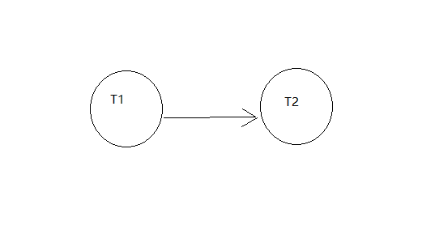
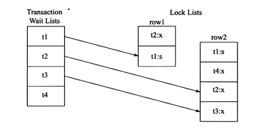
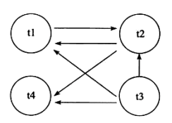
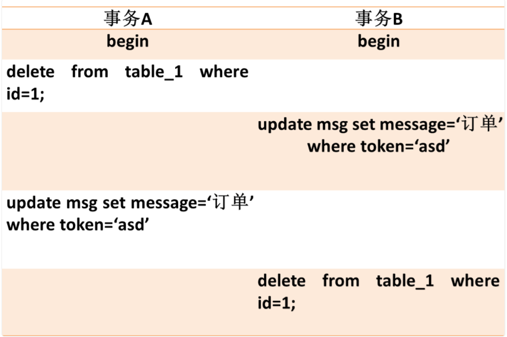
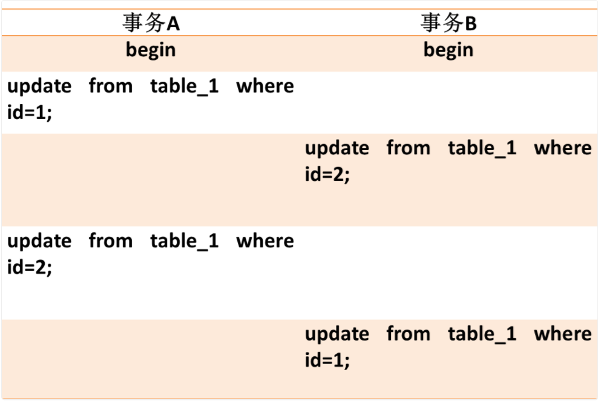
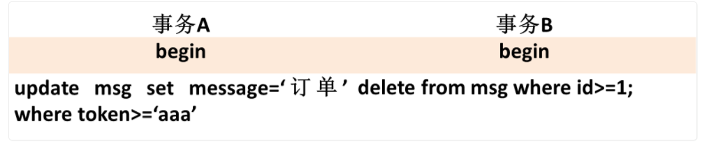
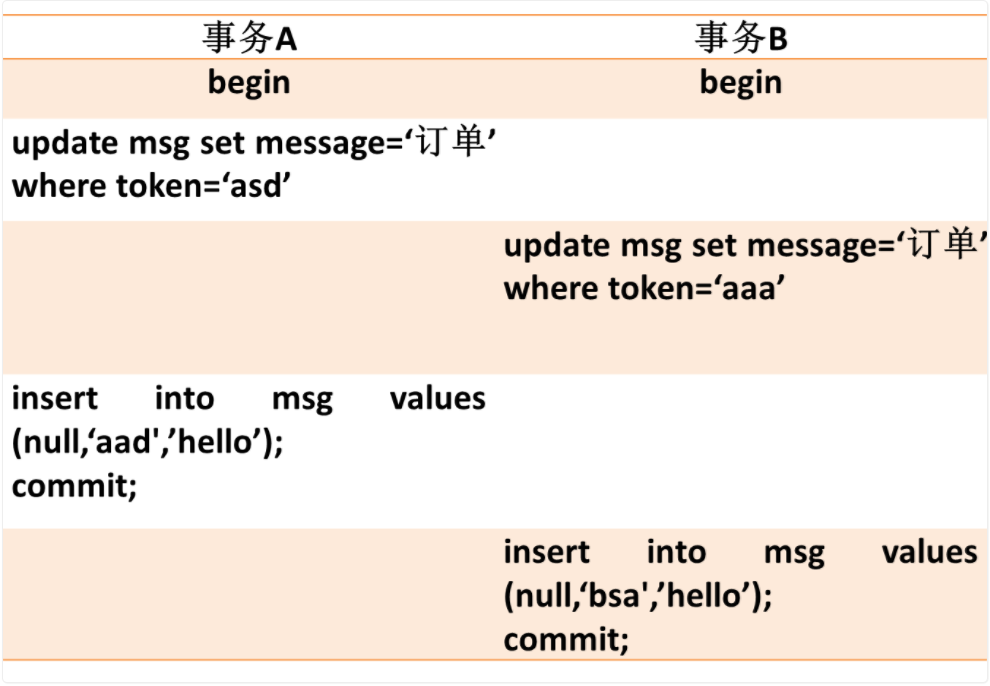

## 深入理解MySQL8中死锁及线上故障解决

### 一、什么是死锁

**死锁是指两个或两个以上的事务在执行过程中，因争夺锁资源而造成的一种互相等待的现象。
若无外力作用，事务都将无法推进下去。** 解决死锁问题最简单的方式是不要有等待，
将任何的等待都转化为回滚，并且事务重新开始。毫无疑问，这的确可以避免死锁问题的产生。
然而在线上环境中，这可能导致并发性能的下降，甚至任何一个事务都不能进行。
而这所带来的问题远比死锁问题更为严重，因为这很难被发现并且浪费资源。

### 二、死锁解决方案

**超时**

解决死锁问题最简单的一种方法是超时，即当两个事务互相等待时，当一个等待时间超过设置的某一阂值时，
其中一个事务进行回滚，另一个等待的事务就能继续进行。

在 InnoDB 存储引擎中，参数 innodb_lock_wait_timeout 用来设置超时的时间。
超时机制虽然简单，但是其仅通过超时后对事务进行回滚的方式来处理，或者说其是根据 FIFO 的顺序选择回滚对象。
但若超时的事务所占权重比较大，如事务操作更新了很多行，占用了较多的undo log。
这时采用 FIFO 的方式，就显得不合适了，因为回滚这个事务的时间相对另一个事务所占用的时间可能会很多。

因此，除了超时机制，当前数据库还都普遍采用 wait_for_graph（等待图）的方式来进行死锁检测。

**wait_for_graph**

它是一种主动的死锁检测方式。InnoDB 存储引擎也采用的这种方式。

- 锁的信息链
- 事务等待链

通过上述链表可以构造出一张图，而在这个图中若存在回路，就代表存在死锁，因此资源间相互发生等待。

在 wait_for_graph中，事务为图中的节点。而在图中，事务 Tl 指向 T2 边的定义为：

- 事务 Tl 等待事务 T2 所占用的资源
- 事务 Tl 最终等待 T2 所占用的资源，也就是事务之间在等待相同的资源，而事务 Tl 发生在事务 T2 的后面



下面来看一个例子，当前事务和锁的状态如下图所示。



在 TransactionWaitLists 中可以看到共有 4 个事务 tl 、 t2 、 t3 、 t4 ，故在 wait 一 for graph 中应有 4 个节点。
而事务 t2 对 rowl 占用 X 锁，事务 tl 对 row2 占用 s 锁。事务 tl 需要等待事务 t2 中 rowl 的资源，
因此在 wait_for_graph 中有条边从节点 tl 指向节点 t2 。事务 t2 需要等待事务 tl 、 t4 所占用的 row2 对象，
故而存在节点 t2 到节点 tl 、 t4 的边。同样，存在节点 t3 到节点 tl 、 t2 、 t4 的边，因此最终的 wait_for_graph 如下图所示



根据图形可以，t1和t2之间存在环路（了解图论算法的同学看到不陌生），所以检测到时存在死锁的。

wait_for_graph是一种较为主动的死锁检测机制，在每个事务请求锁并发生等待时都会判断是否存在回路，
若存在则有死锁，通常来说 InnoDB 存储引擎选择回滚 undo 量最小的事务。 wait_for_graph 的死锁检测通常采用深度优先的算法实现，
在 InnoDB 1.2 版本之前，都是采用递归方式实现。而从 1.2 版本开始，对 wait_for graph 的死锁检测进行了优化，将递归用非递归方式
进行了实现，进一步提高了InnoDB的性能。


### 三、死锁产生的几种情况示例

#### 3.1 不同表相同行冲突

事务A和事务B操作两张表，但出现循环等待锁情况。A等B释放资源，B等待A释放资源。



#### 3.2 相同表记录行锁冲突

这种情况比较常见，也是在业务上最常见到的。之前遇到两个job在执行数据批量更新时，jobA处理的的id列表为[1,2,3,4]，而jobB处理的id列表为[8,9,10,4,2]，这样就造成了死锁。




#### 3.3 不同索引锁冲突

这种情况比较隐晦，事务A在执行时，除了在二级索引加锁外，还会在聚簇索引上加锁，在聚簇索引上加锁的顺序是[1,4,2,3,5]，
而事务B执行时，只在聚簇索引上加锁，加锁顺序是[1,2,3,4,5]，这样就造成了死锁的可能性。



#### 3.4 gap锁冲突

InnoDB在RR级别下，如下的情况也会产生死锁，比较隐晦。




### 四、死锁定位

1. 通过应用业务日志定位到问题代码，找到相应的事务对应的sql

形如以下

```mysql
start transaction;

delete from tableA where id = 1;
update tableA set name = 'xxx' where id = 2;

commit;
```

2. 确定数据库隔离级别

执行`select @@global.tx_isolation`确定数据库的隔离级别，我们数据库的隔离级别是RC，这样可以很大概率排除gap锁造成死锁的原因。


3. 执行下show InnoDB STATUS查看最近死锁的日志

这个步骤非常关键。通过DBA的帮忙，我们可以有更为详细的死锁信息。通过此详细日志一看就能发现，与之前事务相冲突的事务结构如下：

```mysql
start transaction;

update tableA set name = 'xxx' where id = 2;
delete from tableA where id = 1;

commit;

```

这样就很清晰的看出来是`相同表记录行锁冲突`造成的冲突。

### 五、其他

#### 5.1 死锁异常究竟是哪个事务抛出

**测试表数据结构及一些测试数据**

```mysql

DROP TABLE IF EXISTS `person_info`;
CREATE TABLE `person_info`  (
  `id` int(11) NOT NULL AUTO_INCREMENT,
  `name` varchar(100) CHARACTER SET utf8mb4 COLLATE utf8mb4_general_ci NOT NULL,
  `birthday` date NOT NULL,
  `phone_number` char(11) CHARACTER SET utf8mb4 COLLATE utf8mb4_general_ci NOT NULL,
  `country` varchar(100) CHARACTER SET utf8mb4 COLLATE utf8mb4_general_ci NOT NULL,
  PRIMARY KEY (`id`) USING BTREE,
  INDEX `idx_name_birthday_phone_number`(`name`, `birthday`, `phone_number`) USING BTREE
) ENGINE = InnoDB AUTO_INCREMENT = 4 CHARACTER SET = utf8mb4 COLLATE = utf8mb4_general_ci ROW_FORMAT = Dynamic;

-- ----------------------------
-- Records of person_info
-- ----------------------------
INSERT INTO `person_info` VALUES (1, '张三', '2019-07-31', '13000000000', '中国');
INSERT INTO `person_info` VALUES (2, '李四', '2017-02-01', '15600000000', '中国');
INSERT INTO `person_info` VALUES (3, 'tom', '2019-08-01', '18888888888', '美国');

```

**事务隔离级别是RR**

**实验1**

```mysql
-- 事务A
begin;
select * from person_info where id = 1 for update;

-- 事务B
begin;
update person_info set name = 'tom3333' where id = 3;

-- 事务A
update person_info set name = 'tomaaaaa' where id = 3;
-- 此时事务A处理等待状态...

-- 事务B
update person_info set name = '张三bbbb' where id = 1;
-- 当事务B一执行上面sql,事务A立马抛出死锁异常

-- 事务A此时被检测到死锁，被重启事务了。此时事务B还是有效的。
1213 - Deadlock found when trying to get lock; try restarting transaction
```

**实验2**

```mysql
-- 事务A
begin;
select * from person_info where id = 1 for update;

-- 事务B
begin;
select * from person_info where id = 3 for update;

-- 事务A
update person_info set name = 'tomaaaaa' where id = 3;
-- 此时事务A处理等待状态...

-- 事务B
update person_info set name = '张三bbbbbb' where id = 1;
-- 事务B一执行上面sql,客户端B立马抛出死锁异常

1213 - Deadlock found when trying to get lock; try restarting transaction
```

以上两个实验，mysql都检测到了死锁，为什么实验1中由事务2触发死锁，重启的是事务1？
但是实验2 中，事务2触发死锁，重启的却是事务2？ 

所以，mysql在检测到死锁以后，重启的事务的依据是什么呢？

总的依据就是重启**undo量最小的事务**。

看哪个事务的权重最小，事务权重的计算方法：事务加的锁最少；事务写的日志最少；事务开启的时间最晚。
实验1，事务B写了日志，事务A没有，回滚事务A。实验2，都没写日志，但是事务A开始的早，回滚事务B。

#### 5.2 参考
- 《MySQL技术内幕：InnoDB存储引擎》第二版
-  [由一次线上问题带来的MySQL死锁问题分析](http://benjaminwhx.com/2018/02/28/%E7%94%B1%E4%B8%80%E6%AC%A1%E7%BA%BF%E4%B8%8A%E9%97%AE%E9%A2%98%E5%B8%A6%E6%9D%A5%E7%9A%84MySQL%E6%AD%BB%E9%94%81%E9%97%AE%E9%A2%98%E5%88%86%E6%9E%90/)


