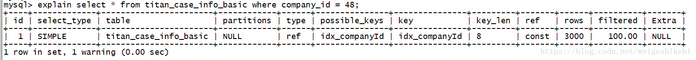

## 五、索引和算法
### 1. Innodb概述
1. 类型
   1. B+索引
   2. 全文索引
   3. 哈希索引
2. B+索引并不能找到一个给定键值的具体行。B+索引能够找到的是被查询数据行所在页。然后数据库通过把页读入到内存，在在内存中进行查找，最后得到要查找的数据。
### 2. 数据结构和算法
略
### 3. B+树
略
### 4. B+树索引
1. B+树索引就是B+树在数据库层面的实现
2. B+树索引的高扇出性，所以在数据库中B+树的高度一般为2-4层，所以只需要很少的IO即可查找所查找的数据
3. B+树索引分为聚集索引（Clustered Index）和辅助索引(Secondary Index)
4. 无论是聚集索引还是辅助索引，其底层的数据结构都是B+树。区别是：其叶子节点存放的是否是一整行数据
5. 聚集索引

   就是按照每张表的主键构建一课B+树，同时叶子节点存放的是整张表的行记录数据。也将聚集索引的叶子节点称为数据页。并且叶子节点时间是一个双向链表
6. 辅助索引（非聚集索引）

   叶子节点不包含行记录的全部数据。叶子节点除了包含键值以外，每个节点的所银行还包含一个书签，该书签用来告诉Innodb引擎
   哪里可以找到索引对应的行数据。因此Innodb引擎的辅助索引的书签对应的就是行数据的聚集索引的键。
7. B+树索引的分裂

   B+索引的分裂并不是都是从页的中间开始分裂，这样的话会导致页空间的浪费。如123等等按照顺序插入时这样的情况下。

   通过PAGE_LAST_INSERT、PAGE_DIRECTION、PAGE_N_DIRECTION来决定向左还是向右分裂，同时决定分裂点的记录是哪一个


8. B+树索引的管理

   (1) 创建、添加、查看索引

   (2) Fast Index Creation

   (3) OSC online Schema Change

   (4) Online DDL
9. Cardinality值

   1. 查看索引
      ```
      show index from tb_name;
      ```

      

      上面有一个属性Cardinality，可以通过观察它来评估索引是否合理。

      它会估计索引中不重复记录，如果这个相对值很小，可能就要评估索引是否有意义。
   2. 索引相对值

      再看一个模拟真实场景的表

      

      然后看一下这张表的总条数

      

      观察下面表格

      

      列id由于是主键，通过cardinality估算出来的值/总数接近于1；而另外2个索引列，估算出来的值/总数都趋近于0。估算出来的值/总数=占比，我们称占比为相对值。

      通过上面表格做一个大胆推测，查询id列是很快，查询另外2列是很慢；现在我们看下相应的执行计划

      

      

      但是发现都会走索引，而且ref都是const。难道是cardinality不准？是的，因为它是一个预估值！

   3. cardinality是怎么预估的

      上面提到cardinality是索引中不重复记录的预估值，那么它是怎么实现的呢？由于Mysql的B+索引在每个存储引擎中实现的都不一样，
      所以cardinality干脆放到存储引擎层面实现的！

      对于innodb来说，达到以下2点就会重新计算cardinality。

      - 如果表中1/16的数据发生变化
      - 如果stat_modified_counter>200 000 0000

      这是为什么呢？因为真实环境中，索引的更新可能非常频繁，比如一个表中数据的插入，更新，删除等，
      每次都去统计cardinality会带来很大的负担；另外如果是一个大表，统计一次可能非常耗时。基于此，采用基于上面2个条件的"抽样"统计的方式。

      那上面2种有什么区别呢？

      如果表中1/16数据发生变化则会更新；第2种情况比较特别，如果某一千数据频繁更新，但是数据并没有增加，则第一种无法适用，
      所以设置stat_modified_counter为发生变化的次数；如果次数达到200 000 0000，也会更新统计值。

      那具体是如何采样统计的呢？

      - 获取B+树叶子节点的数据，记为A
      - 随机获得B+树索引中8个叶子节点。统计每个页不同记录的个数，分别记为P1,P2...P8
      - 计算cardinality = (P1+P2+...P8)A/8

      从而得出索引中不同记录的数量。从上面可以发现，有2个问题

      - 由于是随机采样的方式，所以会出现，连续2次统计，数量都不同。只有在表数据非常少，叶子节点不多于8个时，
        每次采样都是取到相同的页，统计值才会相同
      - 由于统计值是基于上面2个条件去更新的，可能出现系统运行了一段时间之后，数据发生了很大变化，统计值偏差比较大了，
        那么索引的效率会下降

      那对于问题2，该怎么处理呢？

      手动更新统计值

      如果系统运行一段时间之后，我们可以通过执行下面的sql，重新计算cardinality值

      ```
      analyze table tb_name;
      show table status;
      show index from tb_name
      ```

      不过，如果表很大，重新统计可能会非常耗时间，建议对于核心表，在非高峰时段操作

   4. 选择性

      现在又回到前面的例子，我们通过观察执行计划发现，不论cardinality大小，相对值大小，发现还是会走索引，那为什么要说对于相对值非常小的不建议建索引呢？
      这就涉及到一个选择性的问题。

      比如有一个用户表，有一列性别sex，现在要查询所以性别为male的用户(假定只有男人-male，女人-female，没有其它不明性别),可能的sql

      ```
      select * from user where sex = 'M';
      ```

      对于这个sql，虽然sex上有索引，但是执行的时候，读取的数据可能会超过一半，甚至在极端情况下(比如程序员的网站)，大部分数据都需要读取，
      所以还是会走全表扫描，这种数据称为低选择性。
      反之，如果是高选择性的，建议建索引 ，比如user表中用户，一般来说很少重复；
10. B+树索引的使用
    1. 不同应用中的使用
    2. 联合索引
       - 最右匹配原则
    3. 覆盖索引
       Innodb支持覆盖索引。即通过辅助索引就可以得到查询的记录，而不需要查询聚集索引中记录。
       使用覆盖索引的一个好处是辅助索引不需要包含整行所有的信息，所以其大小远小于聚集索引。

    4. 优化器选择不使用索引的情况

    5. 索引提示
       ```
       // innodb引擎还是根据自己的判断选择使用的索引
       select * from t use index(a) where a=1 and b=2
       
       // 这是会使用强制使用的索引列
       select * from t force index(a) where a=1 and b=2
       ```

    6. Multi-Range-Read(MRR)

    7. Index Condition Pushdown ICP优化
11. 哈希算法
    1. 哈希表
    2. 
12. 全文检索


