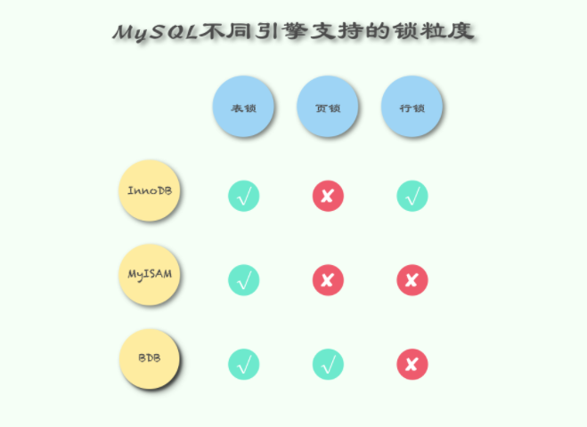
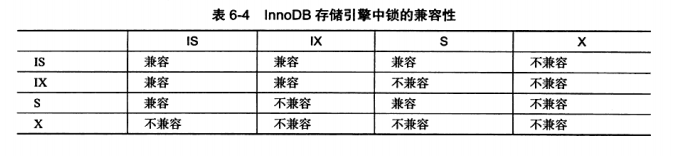

## 深入理解MySQL中的锁
### 一、什么是锁
#### 1.1 为什么需要锁
开发多用户、数据库驱动的应用系统，最大的一个难点：一方面就是要最大程度的利用数据库的并发访问，另一方面还要确保每个用户能一致的方式修改
和读取数据。因此，有了锁。当然，这也是数据库系统区别于文件系统的特点。

保证数据并发访问的一致性、有效性，是所有数据库必须解决的一个问题，
锁的冲突也是影响数据库并发访问性能的一个重要因素。从这一角度来说，锁对于数据库而言就显得尤为重要。

而MySQL是我们开发中经常使用，今天我们就来聊聊MySQL中的锁到底怎么回事。

#### 1.2 什么是锁
锁是数据库系统区别文件系统的关键特性。<span style='color:red'>锁机制用于管理对共享资源的并发访问</span>。

Innodb引擎会在行级别上对表数据进行上锁。不过存储引擎也会在数据库内部的其他多个地方
使用锁，从而允许对多个不同资源提供并发访问。例如，操作缓存持中的LRU列表，删除，添加
，移动LRU列表，为了保证一致性，必须要有锁介入。这也间接了证明了数据库系统使用锁是为了
支持共享资源进行并发访问，以达到提供数据的完整性和一致性的目的。

同时，我们知道，由于SQL标准的存在，“导致”越来越多的数据库越来越像。但是其数据库锁的实现
机制，不同的数据库是完全不一样，不存在你掌握了MySQL的锁实现，而Oracle也是类似实现的。

此外，MySQL中的MyISAM引擎使用的表锁的设计。并发情况下，读是没有问题的，但是并发插入的
性能就要差一些。要是在底部插入的，其还是有一定的并发插入的。

### 二、MySQL中的锁
#### 2.1 锁
MySQL中有着Lock和Latch的概念，在数据库中，这两者都可以被称为“锁”，但是两者有着截然不同的含义


Latch一般称为闩锁（轻量级的锁），因为其要求锁定的时间必须非常短。若持续的时间长，则应用的性能会非常差，
在InnoDB引擎中，Latch又可以分为mutex（互斥量）和rwlock（读写锁）。
其目的是用来保证并发线程操作临界资源的正确性，并且通常没有死锁检测的机制。

Lock的对象是事务，用来锁定的是数据库中的对象，如表、页、行。并且一般lock的对象仅在事务commit
或rollback后进行释放（不同事务隔离级别释放的时间可能不同）。


#### 2.2 锁的分类
对数据的操作其实只有两种，也就是读和写，而数据库在实现锁时，也会对这两种操作使用不同的锁；
InnoDB 实现了标准的行级锁，也就是共享锁（Shared Lock）和互斥锁（Exclusive Lock）。

- 共享锁（读锁），允许事务读一行数据。
- 排他锁（写锁），允许事务删除或更新一行数据。

而它们的名字也暗示着各自的另外一个特性，共享锁之间是兼容的，而互斥锁与其他任意锁都不兼容。


>如果一个事务T1已经获得了行r的共享锁，那么另外的事务T2可以立即获取
>行r的共享锁，因为读取并没有改变行r的数据，我们称这种情况为锁兼容。
>但是若有其他的事务T3想获取行r的排它锁，那么必须等待事务T1,T2释放行r
>上的的共享锁，我们称这种情况为不兼容。

稍微对它们的使用进行思考就能想明白它们为什么要这么设计，因为共享锁代表了读操作、互斥锁代表了写操作，
所以我们可以在数据库中并行读，但是只能串行写，只有这样才能保证不会发生线程竞争，实现线程安全。

#### 2.3 锁的粒度
Lock锁根据粒度主要分为表锁、页锁和行锁。不同的存储引擎拥有的锁粒度都不同



**表锁**

表级别的锁定是MySQL各存储引擎中最大颗粒度的锁定机制。该锁定机制最大的特点是实现逻辑非常简单，
带来的系统负面影响最小。所以获取锁和释放锁的速度很快。由于表级锁一次会将整个表锁定，
所以可以很好的避免困扰我们的死锁问题。

当然，锁定颗粒度大所带来最大的负面影响就是出现锁定资源争用的概率也会最高，致使并发效果大打折扣。
使用表级锁定的主要是MyISAM，MEMORY，CSV等一些非事务性存储引擎。

表锁的语法很简单：

```
# 获取表锁
LOCK TABLES
    tbl_name [[AS] alias] lock_type
    [, tbl_name [[AS] alias] lock_type] ...

lock_type:
    READ [LOCAL]
  | [LOW_PRIORITY] WRITE

# 释放表锁
UNLOCK TABLES
```

MyISAM在执行查询前，会自动执行表的加锁、解锁操作，一般情况下不需要用户手动加、解锁，但是有的时候也需要显示加锁。
比如：检索某一个时刻t1，t2表中数据数量。

```mysql
LOCK TABLE t1 read, t2 read;
select count(t1.id1) as 'sum' from t1;
select count(t2.id1) as 'sum' from t2;
UNLOCK TABLES;
```

**页锁**

页级锁定是MySQL中比较独特的一种锁定级别，在其他数据库管理软件中也并不是太常见。页级锁定的特点是锁定颗粒度介于行级锁定与表级锁之间，
所以获取锁定所需要的资源开销，以及所能提供的并发处理能力也同样是介于上面二者之间。另外，页级锁定和行级锁定一样，会发生死锁。

在数据库实现资源锁定的过程中，随着锁定资源颗粒度的减小，锁定相同数据量的数据所需要消耗的内存数量是越来越多的，实现算法也会越来越复杂。
不过，随着锁定资源颗粒度的减小，应用程序的访问请求遇到锁等待的可能性也会随之降低，系统整体并发度也随之提升。

<span style='color:red'>使用页级锁定的主要是BerkeleyDB存储引擎。</span>

**行锁**

行级锁定最大的特点就是锁定对象的粒度很小，也是目前各大数据库管理软件所实现的锁定颗粒度最小的。
由于锁定颗粒度很小，所以发生锁定资源争用的概率也最小，能够给予应用程序尽可能大的并发处理能力而提高一些需要高并发应用系统的整体性能。
虽然能够在并发处理能力上面有较大的优势，但是行级锁定也因此带来了不少弊端。
由于锁定资源的颗粒度很小，所以每次获取锁和释放锁需要做的事情也更多，带来的消耗自然也就更大了。
此外，行级锁定也最容易发生死锁。

<span style='color:red'>使用行级锁定的主要是InnoDB存储引擎。</span>

**总结**

- 表级锁：开销小，加锁快；不会出现死锁；锁定粒度大，发生锁冲突的概率最高，并发度最低。
- 行级锁：开销大，加锁慢；会出现死锁；锁定粒度最小，发生锁冲突的概率最低，并发度也最高。
- 页面锁：开销和加锁时间界于表锁和行锁之间；会出现死锁；锁定粒度界于表锁和行锁之间，并发度一般。

从锁的角度来说，表级锁更适合于以查询为主，只有少量按索引条件更新数据的应用，
如Web应用；而行级锁则更适合于有大量按索引条件并发更新少量不同数据，同时又有并发查询的应用，如一些在线事务处理（OLTP）系统。

### 三、InnoDB中的锁
#### 3.1 意向锁
上节提到InnoDB 支持多种粒度的锁，也就是行锁和表锁。为了支持多粒度锁定，InnoDB 存储引擎引入了意向锁（Intention Lock）。

那什么是意向锁呢？我们在这里可以举一个例子：**如果没有意向锁，当已经有人使用行锁对表中的某一行进行修改时，
如果另外一个请求要对全表进行修改，那么就需要对所有的行是否被锁定进行扫描，在这种情况下，效率是非常低的；
不过，在引入意向锁之后，当有人使用行锁对表中的某一行进行修改之前，会先为表添加意向互斥锁（IX），
再为行记录添加互斥锁（X），在这时如果有人尝试对全表进行修改就不需要判断表中的每一行数据是否被加锁了，
只需要通过等待意向互斥锁被释放就可以了**。

与上一节中提到的两种锁的种类相似的是，意向锁也分为两种：

- 意向共享锁（IS）：事务想要在获得表中某些记录的共享锁，需要在表上先加意向共享锁。
- 意向互斥锁（IX）：事务想要在获得表中某些记录的互斥锁，需要在表上先加意向互斥锁。

随着意向锁的加入，锁类型之间的兼容矩阵也变得愈加复杂：



**意向锁其实不会阻塞全表扫描之外的任何请求，它们的主要目的是为了表示是否有人请求锁定表中的某一行数据。**

### 四、行锁的算法
InnoDB存储引擎有3种行锁的算法，其分别是：

- Record Lock：单个行记录上的锁。
- Gap Lock：间隙锁，锁定一个范围，但不包含记录本身。
- Next-Key Lock：Gap Lock+Record Lock，锁定一个范围，并且锁定记录本身。

Record Lock总是会去锁住索引记录，如果InnoDB存储引擎表在建立的时候没有设置任何一个索引，那么这时InnoDB存储引擎会使用隐式的主键来进行锁定。

Next-Key Lock是结合了Gap Lock和Record Lock的一种锁定算法，在Next-Key Lock算法下，InnoDB对于行的查询都是采用这种锁定算法。
例如有一个索引有10，11，13和20这4个值，那么该索引可能被Next-Key Locking的区间为：


除了Next-Key Locking，还有Previous-Key Locking技术。同样上述的值，使用Previous-Key Locking技术，那么可锁定的区间为：


但是不是所有索引都会加上Next-key Lock的，在查询的列是唯一索引（包含主键索引）的情况下，Next-key Lock会降级为Record Lock。

接下来，我们来通过一个例子解释一下。

```
CREATE TABLE z (
    a INT,
    b INT,
    PRIMARY KEY(a),    // a是主键索引
    KEY(b)    // b是普通索引
);
INSERT INTO z select 1, 1;
INSERT INTO z select 3, 1;
INSERT INTO z select 5, 3;
INSERT INTO z select 7, 6;
INSERT INTO z select 10, 8;
```

这时候在会话A中执行 SELECT * FROM z WHERE b = 3 FOR UPDATE ，索引锁定如下：


这时候会话B执行的语句落在锁定范围内的都会进行waiting

```
SELECT * FROM z WHERE a = 5 LOCK IN SHARE MODE;
INSERT INTO z SELECT 4, 2;
INSERT INTO z SELECT 6, 5;
```

用户可以通过以下两种方式来显示的关闭Gap Lock：

- 将事务的隔离级别设为 READ COMMITED。
- 将参数innodb_locks_unsafe_for_binlog设置为1。

从上面的例子可以看出来，Gap Lock的作用是为了阻止多个事务将记录插入到同一个范围内，
设计它的目的是用来解决Phontom Problem（幻读问题）。
在MySQL默认的隔离级别（Repeatable Read）下，InnoDB就是使用它来解决幻读问题。

>幻读是指在同一事务下，连续执行两次同样的SQL语句可能导致不同的结果，
>第二次的SQL可能会返回之前不存在的行，也就是第一次执行和第二次执行期间有其他事务往里插入了新的行。

### 五、一致性非锁定读
一致性非锁定读（consistent nonlocking read）是指InnoDB存储引擎通过多版本控制（MVCC）的方式来读取当前执行时间数据库中行的数据。
如果读取的这行正在执行DELETE或UPDATE操作，这时读取操作不会向XS锁一样去等待锁释放，而是会去读一个快照数据。
MVCC后续会有专门的文章来介绍。、


在事务隔离级别RC和RR下，InnoDB存储引擎使用非锁定的一致性读。
然而对于快照数据的定义却不同，
在RC级别下，对于快照数据，非一致性读总是读取被锁定行的最新一份快照数据。
而在RR级别下，对于快照数据，非一致性读总是读取事务开始时的行数据版本。

下面我们通过一个例子来看看大家对MVCC的理解。


可以看到，第1步和第2步是非常容易理解的，而在第3步事务B插入一条新的数据后，在第4步事务A还是查不到，
也就是利用了MVCC的特性来实现。当事务B提交后，第5步的查询在RC和RR隔离级别下的输出是不同的，
这个的原因是因为他们创建ReadView的时机不同。

但是很诡异的是在第6步的时候，事务A更新了一条它看不见的记录，然后查询就能够查询出来了。
这里很多人容易迷惑，不可见不代表记录不存在，它只是利用了可见性判断忽略了而已。
更新成功之后，事务A顺其自然的记录了这条记录的Undo log，在随后的查询中，
因为它能够看见自己的改动这一个可见性的判断，自然就能够查询出来了。


### 六、一致性锁定读
前面说到，在默认隔离级别RR下，InnoDB存储引擎的SELECT操作使用一致性非锁定读。
但是在某些情况下，用户需要显式地对数据库读取操作进行加锁以保证数据逻辑的一致性。
InnoDB存储引擎对于SELECT语句支持两种一致性的锁定读（locking read）操作。

- SELECT … FOR UPDATE （X锁）
- SELECT … LOCK IN SHARE MODE （S锁）

### 七、其他
#### 7.1 锁带来的问题：丢失更新问题
通过锁定机制可以实现事务隔离性要求，使得事务可以并发的工作。锁提高了并发，但是却会带来潜在的问题。
不过好在有事务隔离性的要求，不同的隔离级别解决的锁的问题也不同，这里只进行简单的介绍，不进行举例分析了。


InnoDB存储引擎在RR级别就已经解决了所有问题，但是它和Serializable的区别在哪里呢？
区别就在于RR级别还存在一个**丢失更新问题**，而SERIALIZABLE无论对于查询还是更新都会进行锁定操作.


如图所示，用户原始金额为100，如果程序中对于转账和存款的判断是先查询再更新的话就会出现丢失更新的问题，
也就是后面的更新覆盖了前面的更新。如果想避免这种问题，只能每次更新的时候金额基于表里最新的值来做。
如果必须要先查询再更新，可以在更新的条件里判断金额（乐观锁），也可以使用隔离级别最高的SERIALIZABLE。

#### 7.2 死锁

死锁是指两个或两个以上的事务在执行过程中，因争夺锁资源而造成的一种互相等待的现象。后面有机会详细聊聊这个。


