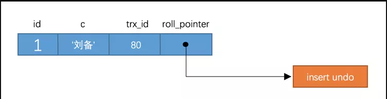

## 深入理解MySQL8中的MVCC实现原理

### 一、事务

事务是数据库的基础，如果对事务陌生或遗忘的话，请回过头参考我的这篇 [基于MySQL 8.0 对事务的深度理解](https://blog.csdn.net/weixin_39723544/article/details/91653513)

### 二、版本链

对于使用`InnoDB`存储引擎的表来说，它的聚簇索引记录中都包含两个必要的隐藏列
（`row_id`并不是必要的，我们创建的表中有主键或者非NULL唯一键时都不会包含`row_id`列）

- `trx_id`：每次对某条聚簇索引记录进行改动时，都会把对应的事务id赋值给`trx_id`隐藏列。
- `roll_pointer`：每次对某条聚簇索引记录进行改动时，都会把旧的版本写入到`undo`日志中，
  然后这个隐藏列就相当于一个指针，可以通过它来找到该记录修改前的信息。
  
比方说我们的表`t`现在只包含一条记录：

```mysql
mysql> SELECT * FROM t;
+----+--------+
| id | c      |
+----+--------+
|  1 | 刘备   |
+----+--------+
1 row in set (0.01 sec)
```

假设插入该记录的事务id为80，那么此刻该条记录的示意图如下所示：



假设之后两个`id`分别为`100`、`200`的事务对这条记录进行`UPDATE`操作，操作流程如下：


>小贴士： 能不能在两个事务中交叉更新同一条记录呢？哈哈，这是不可以滴，第一个事务更新了某条记录后，
>就会给这条记录加锁，另一个事务再次更新时就需要等待第一个事务提交了，把锁释放之后才可以继续更新。
>本篇文章不是讨论锁的，有关锁的更多细节我们之后再说。

关于锁的知识可以看我的另外一篇文章，这里就不多说了。 [深入理解MySQL中的锁机制](https://blog.csdn.net/weixin_39723544/article/details/92646477)

每次对记录进行改动，都会记录一条`undo`日志，每条`undo`日志也都有一个`roll_pointer`属性
（`INSERT`操作对应的`undo`日志没有该属性，因为该记录并没有更早的版本），可以将这些
`undo日志`都连起来，串成一个链表，所以现在的情况就像下图一样：


对该记录每次更新后，都会将旧值放到一条`undo日志`中，就算是该记录的一个旧版本，
随着更新次数的增多，所有的版本都会被`roll_pointer`属性连接成一个链表，
我们把这个链表称之为`版本链`，版本链的头节点就是当前记录最新的值。
另外，每个版本中还包含生成该版本时对应的`事务id`，这个信息很重要，我们稍后就会用到。

### 三、ReadView

对于使用`READ UNCOMMITTED`隔离级别的事务来说，直接读取记录的最新版本就好了，
对于使用`SERIALIZABLE`隔离级别的事务来说，使用加锁的方式来访问记录。
对于使用`READ COMMITTED`和`REPEATABLE READ`隔离级别的事务来说，就需要用到我们上边所说的版本链了，
核心问题就是：需要判断一下版本链中的哪个版本是当前事务可见的。所以设计`InnoDB``的大叔提出了一个ReadView`的概念，
这个`ReadView`中主要包含当前系统中还有哪些活跃的读写事务，把它们的`事务id`放到一个列表中，
我们把这个列表命名为为`m_ids`。所以我们在开启一次会话进行`SQL`读写时，开始事务时生成`readview`时，会把当前系统中正在执行的读写事务写入到`m_ids`列表中，另外还会存储两个值：

- `min_trx_id`：该值代表生成`readview`时`m_ids`中的最小值
- `max_trx_id`：该值代表生成`readview`时系统中应该分配给下一个事务的`id`值。

>小贴士：注意max_trx_id并不是m_ids中的最大值，事务id是递增分配的。
>比方说现在有id为1，2，3这三个事务，之后id为3的记录提交了。那么一个新的读事务在生成readview时，
>m_ids就包括1和2，min_trx_id的值就是1，max_trx_id的值就是4。

所以判断可见性的步骤就是：

- 如果记录的`trx_id`列小于`min_trx_id`，说明肯定可见。
- 如果记录的`trx_id`列大于`max_trx_id`，说明肯定不可见。
- 如果记录的`trx_id`列在`min_trx_id`和`max_trx_id`之间，就要看一下该`trx_id`在不在`m_ids`列表中，如果在，说明不可见，否则可见。

如果某个版本的数据对当前事务不可见的话，那就顺着版本链找到下一个版本的数据，继续按照上边的步骤判断可见性，
依此类推，直到版本链中的最后一个版本，如果最后一个版本也不可见的话，那么就意味着该条记录对该事务不可见，查询结果就不包含该记录。

在MySQL中，`READ COMMITTED`和`REPEATABLE READ`隔离级别的的一个非常大的区别就是它们`生成ReadView`的时机不同，我们来看一下。

### 四、MVCC下版本链的访问过程

#### 4.1 READ COMMITTED --- 每次读取数据前都生成一个ReadView

比方说现在系统里有两个`id`分别为`1`、`2`的事务在执行：

```mysql
# Transaction 100
BEGIN;

UPDATE t SET c = '关羽' WHERE id = 1;

UPDATE t SET c = '张飞' WHERE id = 1;
```

```mysql
# Transaction 200
BEGIN;

# 更新了一些别的表的记录
...

```

>小贴士： 事务执行过程中，只有在第一次真正修改记录时（比如使用INSERT、DELETE、UPDATE语句），才会被分配一个单独的事务id，这个事务id是递增的。

此刻，表`t`中`id`为`1`的记录得到的版本链表如下所示：


假设现在有一个使用`READ COMMITTED`隔离级别的事务开始执行：

```mysql
# 类似于第三个客户端，开启了一个新的事务
# 使用READ COMMITTED隔离级别的事务
BEGIN;

# SELECT1：Transaction 100、200未提交
SELECT * FROM t WHERE id = 1; # 得到的列c的值为'刘备'
```

这个`SELECT1`的执行过程如下:

- 在执行`SELECT`语句时会先生成一个`ReadView`，`ReadView`的`m_ids`列表的内容就是`[100, 200]`, `ReadView`的`min_trx_id`的值为`100`, `ReadView`的`max_trx_id`的值为`300`。
- 然后从版本链中挑选可见的记录，从图中可以看出，最新版本的列`c`的内容是`'张飞'`，该版本的`trx_id`值为`100`，在`min_trx_id`和`max_trx_id`之间，然后在看，发现`trx_id`在`m_ids`列表中，所以不符合可见性要求，根据`roll_pointer`跳到下一个版本。
- 下一个版本的列`c`的内容是`'关羽'`，该版本的`trx_id`值也为`100`，也在`m_ids`列表内，所以也不符合要求，继续跳到下一个版本。
- 下一个版本的列`c`的内容是`'刘备'`，该版本的`trx_id`值为`80`，小于`min_trx_id`的事务id`100`，所以这个版本是符合要求的，最后返回给用户的版本就是这条列c为'刘备'的记录。

之后，我们把`事务id`为`100`的事务提交一下，就像这样：

```mysql
# Transaction 100
BEGIN;

UPDATE t SET c = '关羽' WHERE id = 1;

UPDATE t SET c = '张飞' WHERE id = 1;

COMMIT;
```

然后再到`事务id`为`200`的事务中更新一下表`t`中`id`为`1`的记录：

```mysql
# Transaction 200
BEGIN;

# 更新了一些别的表的记录
...

UPDATE t SET c = '赵云' WHERE id = 1;

UPDATE t SET c = '诸葛亮' WHERE id = 1;

```

此刻，表`t`中`id`为`1`的记录的版本链就长这样：


然后再到刚才使用`READ COMMITTED`隔离级别的事务中继续查找这个`id`为`1`的记录，如下:

```mysql
# 新开的一个客户端字段
# 使用READ COMMITTED隔离级别的事务
BEGIN;

# SELECT1：Transaction 100、200均未提交
SELECT * FROM t WHERE id = 1; # 得到的列c的值为'刘备'

# SELECT2：Transaction 100提交，Transaction 200未提交
SELECT * FROM t WHERE id = 1; # 得到的列c的值为'张飞'

```

这个`SELECT2`的执行过程如下：

- 在执行`SELECT`语句时会先生成一个`ReadView`，`ReadView`的`m_ids`列表的内容就是[200]（事务`id`为`100`的那个事务`已经提交`了，所以生成快照时就没有它了）
- 然后从`版本链`中挑选可见的记录，从图中可以看出，最新版本的列`c`的内容是`'诸葛亮'`，该版本的`trx_id`值为200，在`m_ids`列表内，所以不符合可见性要求，根据`roll_pointer`跳到下一个版本
- 下一个版本的列`c`的内容是`'赵云'`，该版本的`trx_id`值为`200`，也在`m_ids`列表内，所以也不符合要求，继续跳到下一个版本
- 下一个版本的列`c`的内容是`'张飞'`，该版本的`trx_id`值为`100`，小于`min_trx_id`的事务id`100`，所以这个版本是符合要求的，最后返回给用户的版本就是这条列c为'张飞'的记录。

以此类推，如果之后`事务id`为`200`的记录也提交了，再此在使用`READ COMMITTED`隔离级别的事务中查询表t中`id`值为`1`的记录时，
得到的结果就是`'诸葛亮'`了，具体流程我们就不分析了。总结一下就是：使用`READ COMMITTED`隔离级别的事务在每次查询开始时都会生成一个独立的`ReadView`。

#### 4.2 REPEATABLE READ ---在第一次读取数据时生成一个ReadView

对于使用`REPEATABLE READ`隔离级别的事务来说，**只会在第一次执行查询语句时生成**一个`ReadView`，之后的查询就不会重复生成了。我们还是用例子看一下是什么效果。

比方说现在系统里有两个`id`分别为`100`、`200`的事务在执行：

```mysql
# Transaction 100
BEGIN;

UPDATE t SET c = '关羽' WHERE id = 1;

UPDATE t SET c = '张飞' WHERE id = 1;
```

```mysql
# Transaction 200
BEGIN;

# 更新了一些别的表的记录
...
```

此刻，表`t`中`id`为`1`的记录得到的`版本链`表如下所示：


假设现在有一个使用`REPEATABLE READ`隔离级别的事务开始执行：

```mysql
# 使用REPEATABLE READ隔离级别的事务
BEGIN;

# SELECT1：Transaction 100、200未提交
SELECT * FROM t WHERE id = 1; # 得到的列c的值为'刘备'
```

这个`SELECT1`的执行过程如下：

- 在执行`SELECT`语句时会先生成一个`ReadView`，`ReadView`的`m_ids`列表的内容就是`[100, 200]`,`ReadView`的`min_trx_id`的值为`100`, `ReadView`的`max_trx_id`的值为`300`。
- 然后从`版本链`中挑选可见的记录，从图中可以看出，最新版本的列`c`的内容是`'张飞'`，该版本的`trx_id`值为`100`，在`m_ids`列表内，所以不符合可见性要求，根据`roll_pointer`跳到下一个版本。
- 下一个版本的列`c`的内容是`'关羽'`，该版本的`trx_id`值也为`100`，也在`m_ids`列表内，所以也不符合要求，继续跳到下一个版本。
- 下一个版本的列`c`的内容是`'刘备'`，该版本的`trx_id`值为`80`，小于`ReadView`的`min_trx_id`的值`100`，所以这个版本是符合要求的，最后返回给用户的版本就是这条列c为'刘备'的记录。

之后，我们把事务`id`为`100`的事务提交一下，就像这样：

```mysql
# Transaction 100
BEGIN;

UPDATE t SET c = '关羽' WHERE id = 1;

UPDATE t SET c = '张飞' WHERE id = 1;

COMMIT;
```

然后再到事务`id`为`200`的事务中更新一下表`t`中`id`为`1`的记录：

```mysql
# Transaction 200
BEGIN;

# 更新了一些别的表的记录
...

UPDATE t SET c = '赵云' WHERE id = 1;

UPDATE t SET c = '诸葛亮' WHERE id = 1;
```

此刻，表`t`中`id`为`1`的记录的`版本链`就长这样：


然后再到刚才使用`REPEATABLE READ`隔离级别的事务中继续查找这个`id`为`1`的记录，如下：

```mysql
# 新开的一个事务客户端
# 使用REPEATABLE READ隔离级别的事务
BEGIN;

# SELECT1：Transaction 100、200均未提交
SELECT * FROM t WHERE id = 1; # 得到的列c的值为'刘备'

# SELECT2：Transaction 100提交，Transaction 200未提交
SELECT * FROM t WHERE id = 1; # 得到的列c的值仍为'刘备'
```

这个`SELECT2`的执行过程如下：

- 因为之前已经生成过`ReadView`了，所以此时直接复用之前的`ReadView`，之前的`ReadView`中的`m_ids`列表就是`[100, 200]`,`min_trx_id`的值为`100`, max_trx_id`的值为`300`。
- 然后从`版本链`中挑选可见的记录，从图中可以看出，最新版本的列`c`的内容是`'诸葛亮'`，该版本的`trx_id`值为`200`，在`m_ids`列表内，所以不符合可见性要求，根据`roll_pointer`跳到下一个版本。
- 下一个版本的列`c`的内容是`'赵云'`，该版本的`trx_id`值为`200`，也在`m_ids`列表内，所以也不符合要求，继续跳到下一个版本。
- 下一个版本的列`c`的内容是`'张飞'`，该版本的`trx_id`值为`100`，而`m_ids`列表中是包含值为`100`的`事务id`的，所以该版本也不符合要求，同理下一个列`c`的内容是`'关羽'`的版本也不符合要求。继续跳到下一个版本。
- 下一个版本的列`c`的内容是`'刘备'`，该版本的`trx_id`值为`80`，`80`小于`min_trx_id`的值`100`，所以这个版本是符合要求的，最后返回给用户的版本就是这条列`c`为`'刘备'`的记录。

也就是说两次`SELECT`查询得到的结果是重复的，记录的列`c`值都是`'刘备'`，这就是`可重复读`的含义。如果我们之后再把事务`id`为`200`的记录提交了，之后再到刚才使用`REPEATABLE READ`隔离级别的事务中继续查找这个`id`为1的记录，得到的结果还是`'刘备'`，具体执行过程大家可以自己分析一下。

### 五、总结
从上边的描述中我们可以看出来，所谓的`MVCC`（`Multi-Version Concurrency Control `，多版本并发控制）
指的就是在使用`READ COMMITTD`、`REPEATABLE READ`这两种隔离级别的事务在执行普通的`SEELCT`操作时访问记录的版本链的过程，
这样子可以使不同事务的读-写、写-读操作并发执行，从而提升系统性能。`READ COMMITTD`、`REPEATABLE READ`这两个隔离级别
的一个很大不同就是生成`ReadView`的时机不同，`READ COMMITTD`在每一次进行普通`SELECT`操作前都会生成一个`ReadView`，
而`REPEATABLE READ`只在第一次进行普通`SELECT`操作前生成一个`ReadView`，之后的查询操作都重复这个`ReadView`就好了。

参考：
    《MySQL是怎样运行的：从根上理解MySQL》
    《高性能MySQL》


