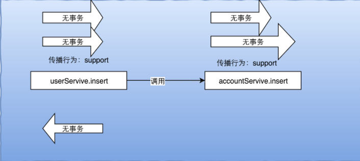

## Spring中的事务及数据库事务的关系
### 一、MySQL中的事务

如果对MySQL中的事务不了解的话，请先看 [基于MySQL 8.0 对事务的深度理解](https://blog.csdn.net/weixin_39723544/article/details/91653513)

### 二、Spring中的事务
1. Spring管理事务的方式
   1. 编程式事务
      编程式事务就是利用手动代码编写事务相关的业务逻辑，这种方式比较复杂、啰嗦，但是更加灵活可控制。
   2. 声明式事务
      其实包括xml配置和注解的使用方式。
      
      xml形如下：
      
      ```xml
        <tx:advice id="txAdvice" transaction-manager="txManager"> 
        <tx:attributes>  <!--设置所有匹配的方法，然后设置传播级别和事务隔离-->
                   <tx:method name="save*" propagation="REQUIRED" /> 
                   <tx:method name="add*" propagation="REQUIRED" /> 
                   <tx:method name="create*" propagation="REQUIRED" /> 
                   <tx:method name="insert*" propagation="REQUIRED" /> 
                   <tx:method name="update*" propagation="REQUIRED" /> 
                   <tx:method name="merge*" propagation="REQUIRED" /> 
                   <tx:method name="del*" propagation="REQUIRED" /> 
                   <tx:method name="remove*" propagation="REQUIRED" /> 
                   <tx:method name="put*" propagation="REQUIRED" /> 
                   <tx:method name="get*" propagation="SUPPORTS" read-only="true" /> 
                   <tx:method name="count*" propagation="SUPPORTS" read-only="true" /> 
                  <tx:method name="find*" propagation="SUPPORTS" read-only="true" /> 
                  <tx:method name="list*" propagation="SUPPORTS" read-only="true" /> 
                  <tx:method name="*" propagation="SUPPORTS" read-only="true" /> 
               </tx:attributes> 
        </tx:advice> 
        <aop:config> 
               <aop:pointcut id="txPointcut" expression="execution(* org.transaction..service.*.*(..))" /> 
               <aop:advisor advice-ref="txAdvice" pointcut-ref="txPointcut" /> 
        </aop:config>
      ```
      
      注解形如下：
      ```xml
      <tx:annotation-driven transaction-manager="transactionManager" /><!--开启注解的方式-->
      ```
      >@transaction注解可以放在方法上或者类上

2. Spring事务传播行为
   1. 含义
   
      Spring管理的事务是逻辑事务，而且物理事务和逻辑事务最大差别就在于事务传播行为，
      事务传播行为用于指定在多个事务方法间调用时，事务是如何在这些方法间传播的。下面解结合例子加伪代码的方式进行讲解。
      
   2. Required
   
      必须有逻辑事务，否则新建一个事务。
      使用PROPAGATION_REQUIRED指定，表示如果当前存在一个逻辑事务，则加入该逻辑事务。否则将新建一个逻辑事务，如下图所示。
      
      
      
      按照required传播行为的逻辑，代码执行的逻辑如下：
      - 在调用userService对象的insert方法时，此方法用的是Required传播行为且
        此时Spring事务管理器发现还没开启逻辑事务，因此Spring管理器会开启逻辑事务。
      - 在此逻辑事务中调用了accountService对象的insert方法，而在insert方法中发现同样用的是Required传播行为，
        因此直接使用该已经存在的逻辑事务。
      - 返回userService，执行完并关闭事务。
      
      <span style='color:red'>这种情况下，两个事务属于同一个事务，一个回滚则两个任务都回滚。</span>
      
   3. RequiresNew
   
      每次都会创建新的逻辑事务。使用PROPAGATION_REQUIRES_NEW指定，表示每次都创建新的逻辑事务（物理事务也是不同的）如下图所示。
      
      
      
      <span style='color:red'>这种情况下，两个事务是独立的，一个回滚则并不会影响另外一个事务。</span>
      
   4. Supports
      
      支持当前事务，使用PROPAGATION_SUPPORTS指定，指如果当前存在逻辑事务，就加入到该逻辑事务。
      如果当前没有逻辑事务，就以非事务方式执行，如下图所示。
      
      一句话<span style='color:red'>就是有事务就加入，没有就按照没有事务的方式执行。</span>
      
      
      
   5. NotSupported
      
      不支持事务，如果当前存在事务则暂停该事务。使用PROPAGATION_NOT_SUPPORTED指定，即以非事务方式执行，如果当前存在逻辑事务，就把当前事务暂停，以非事务方式执行。
      
      一句话<span style='color:red'>以非事务的方式，如果有事务，就把事务关闭。</span>
   6. Mandatory
   
      必须有事务，否则抛出异常。
      使用PROPAGATION_MANDATORY指定，使用当前事务执行，如果当前没有事务，则抛出异常（IllegalTransactionStateException）。
      当运行在存在逻辑事务中则以当前事务运行，如果没有运行在事务中，则抛出异常。
   
   7. Never
      
      不支持事务。如果当前存在是事务则抛出异常，使用PROPAGATION_NEVER指定。
      即以非事务方式执行，如果当前存在事务，则抛出异常（IllegalTransactionStateException）
      
   8. Nested
      
      嵌套事务支持。使用PROPAGATION_NESTED指定。
      如果当前存在事务，则在嵌套事务内执行；如果当前不存在事务，则创建一个新的事务。
      嵌套事务使用数据库中的保存点来实现，即嵌套事务回滚不影响外部事务，但外部事务回滚将导致嵌套事务回滚。
      
      
      
      Nested和RequiresNew的区别:
      - RequiresNew每次都创建新的独立的物理事务，而Nested只有一个物理事务;
      - Nested嵌套事务回滚或提交不会导致外部事务回滚或提交，但外部事务回滚将导致嵌套事务回滚，而 RequiresNew由于都是全新的事务，所以之间是无关联的；
      - Nested使用JDBC 3的保存点(save point)实现，即如果使用低版本驱动将导致不支持嵌套事务;
      - 使用嵌套事务，必须确保具体事务管理器实现的nestedTransactionAllowed属性为true，
        否则不支持嵌套事务，如DataSourceTransactionManager默认支持，而HibernateTransactionManager默认不支持，需要设置来开启。
### 三、项目中的使用
项目中针对增删改操作一般使用Required级别。对针对查询使用Support或NotSupport.
其他的传播行为用的比较少。


