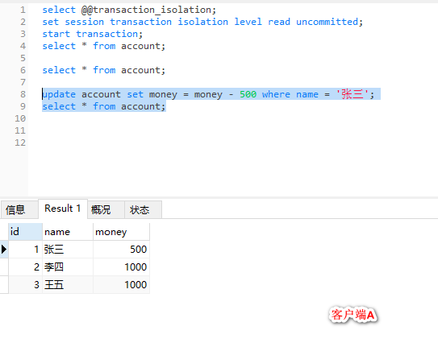

## 基于MySQL 8.0 对事务的再理解
### 一、MySQL中事务隔离级别
1. 事务的隔离级别有哪些？

| 隔离级别 | 脏读	 | 不可重复读 |  幻读(虚读) |
| ------ | ------ | ------ | ------ |
| 未提交读（Read uncommitted） | 可能 | 可能 | 可能 |
| 已提交读（Read committed） | 不可能 | 可能 | 可能 |
| 可重复读（Repeatable read） | 不可能 | 不可能 | 可能 |
| 可串行化（Serializable ） | 不可能 | 不可能 | 不可能 |

**Read uncommitted**： 顾名思义，就是一个事务可以读取另一个未提交事务的数据。

事例：老板要给程序员发工资，程序员的工资是3.6万/月。但是发工资时老板不小心按错了
数字，按成3.9万/月，该钱已经打到程序员的户口，但是事务还没有提交，就在这时，程
序员去查看自己这个月的工资，发现比往常多了3千元，以为涨工资了非常高兴。
但是老板及时发现了不对，马上回滚差点就提交了的事务，将数字改成3.6万再提交。

分析：实际程序员这个月的工资还是3.6万，但是程序员看到的是3.9万。
他看到的是老板还没提交事务时的数据。这就是脏读。

解决：Read committed！读提交就能解决脏读问题。

**Read committed**： 顾名思义，就是一个事务要等另一个事务提交后才能读取数据。

事例：程序员拿着信用卡去享受生活（卡里当然是只有3.6万），当他埋单时（程序员事务开启），
收费系统事先检测到他的卡里有3.6万，就在这个时候！！程序员的妻子要把钱全部转出充当家用，并提交。
当收费系统准备扣款时，再检测卡里的金额，发现已经没钱了（第二次检测金额当然要等待妻子转出金额事务提交完）。
程序员就会很郁闷，明明卡里是有钱的。

分析：这就是读提交，若有事务对数据进行更新（UPDATE）操作时，
读操作事务要等待这个更新操作事务提交后才能读取数据，可以解决脏读问题。
但在这个事例中，出现了一个事务范围内两个相同的查询却返回了不同数据，这就是不可重复读。

解决：Repeatable read ！

**Repeatable read**: 就是在开始读取数据（事务开启）时，不再允许修改操作.

事例：程序员拿着信用卡去享受生活（卡里当然是只有3.6万），当他埋单时（事务开启，不允许其他事务的UPDATE修改操作），
收费系统事先检测到他的卡里有3.6万。这个时候他的妻子不能转出金额了。接下来收费系统就可以扣款了。

分析：重复读可以解决不可重复读问题。写到这里，应该明白的一点就是，不可重复读对应的是修改，即UPDATE操作。
但是可能还会有幻读问题。因为幻读问题对应的是插入INSERT操作，而不是UPDATE操作。

解决：使用Serializable的隔离级别。

**Serializable** 序列化：Serializable 是最高的事务隔离级别，在该级别下，事务串行化顺序执行，可以避免脏读、不可重复读与幻读。
但是这种事务隔离级别效率低下，比较耗数据库性能，一般不使用。

2. 事务的四大基本特性(ACID)及理解？
   1. 原子性（Atomicity）：
      事务包含的所有操作要么全部成功，要么全部失败回滚，因此事务的操作如果成功就必须要完全应用到数据库，如果操作失败则不能对数据库有任何影响。
      也就是说事务是一个不可分割的整体，就像化学中学过的原子，是物质构成的最基本单位。
   2. 一致性（Consistency）：
      事务开始前和结束后，数据库的完整性约束没有被破坏 。
      拿转账来说，假设用户A和用户B两者的钱加起来一共是5000，那么不管A和B之间如何转账，转几次账，事务结束后两个用户的钱相加起来应该还得是5000，这就是事务的一致性。
   3. 隔离性（Isolation）：
      同一时间，只允许一个事务请求同一数据，不同的事务之间彼此没有任何干扰。
      即要达到这么一种效果：对于任意两个并发的事务T1和T2，在事务T1看来，T2要么在T1开始之前就已经结束，要么在T1结束之后才开始，这样每个事务都感觉不到有其他事务在并发地执行。
   4. 持久性（Durability）：
      持久性是指一个事务一旦被提交了，那么对数据库中的数据的改变就是永久性的，即便是在数据库系统遇到故障的情况下也不会丢失提交事务的操作。
      
   
### 二、MySQL中事务的常见操作
1. 查看当前会话的数据库的隔离级别
```
// MySQL 8.0
select @@transaction_isolation;
或者
show variables like 'transaction_isolation'

// MySQL 8.0之前的版本
select @@tx_isolation;
```

>如果出现Unknown system variable 'tx_isolation' 错误。 
>MySQL8.0之前的写法是 `select @@tx_isolation;`  MySQL8.0后改成了`select @@transaction_isolation; `
2. 查看系统级别的数据库的隔离级别
``` 
// MySQL 8.0
select @@global.transaction_isolation;


// MySQL 8.0之前的版本
select @@global.tx_isolation;
```
3. 修改当前会话的事务隔离级别
``` 
set session transaction isolation level 事务的隔离级别;

如：
set session transaction isolation level read committed;
```
4. 修改全局的事务隔离级别
``` 
set session global transaction isolation level 事务的隔离级别;

如：
set session global transaction isolation level read committed;
```
5. 开启事务
```
start transaction;
```
6. 提交事务
``` 
commit;
```
7. 回滚
``` 
rollback;
```
### 三、脏读示例验证
1. 示例表的结构及初始测试数据
   ``` 
   DROP TABLE IF EXISTS `account`;
   CREATE TABLE `account`  (
     `id` int(11) NOT NULL AUTO_INCREMENT,
     `name` varchar(255) CHARACTER SET utf8 COLLATE utf8_general_ci DEFAULT NULL,
     `money` int(255) DEFAULT NULL,
     PRIMARY KEY (`id`) USING BTREE
   ) ENGINE = InnoDB CHARACTER SET = utf8 COLLATE = utf8_general_ci ROW_FORMAT = Dynamic;
   
   -- ----------------------------
   -- Records of account
   -- ----------------------------
   INSERT INTO `account` VALUES (1, '张三', 1000);
   INSERT INTO `account` VALUES (2, '李四', 1000);
   INSERT INTO `account` VALUES (3, '王五', 1000);
   ```
2. 读未提交
   1. 打开一个客户端A，并设置当前事务模式为read uncommitted（未提交读），查询表account的初始值。
      ``` 
      - select @@transaction_isolation;
      set session transaction isolation level read uncommitted;
      start transaction;
      select * from account;
      ```
      
      
      
   2. 在客户端A的事务提交之前，打开另一个客户端B，更新表中张三的account。
      ``` 
      - select @@transaction_isolation;
      set session transaction isolation level read uncommitted;
      start transaction;
      update account set money = money - 500 where name = '张三';
      ```
   3. 这时，虽然客户端B的事务还没提交，但是客户端A就可以查询到B已经更新的数据。
      发现此时张三的余额已经变成500了。
      
      
      
   4. 一旦客户端B的事务因为某种原因回滚，所有的操作都将会被撤销，那客户端A查询到的数据其实就是脏数据。
      ``` 
      // 模拟遇到意外情况，进行回滚。
      rollback;
      select * from account;
      ```
      此时发现张三的查询的结果变成了原来的1000.
      
      
      
   5. 假如说现在客户端A在此时执行`update account set money = money - 500 where name = '张三'`的修改语句，会发现修改后的结果竟然是500,而不是0元。
      我刚查到的张三的余额是500啊，减去500后，余额应该是0元啊，现在怎么还是500。这样的事情在客户端A在这里看来是不可思议的，而且是极为不正常的，但是
      作为有上帝视角的我们，却知道这一切的真相。
      
      ``` 
      update account set money = money - 500 where name = '张三';
      select * from account;
      ```
      
      
      
### 四、不可重复读示例验证
把事务隔离级别设置到“读已提交”，可以解决上述问题。大家可以重复上面示例步骤进行验证下，会发现没有脏读问题。
但是又出现了新的问题。可重复读的问题。

首先把所有的数据金额初始为1000元，事务隔离级别设置成“读已提交”。

1. 不可重复读
   1. 打开一个客户端A，并设置当前事务模式为read committed（读已提交），查询表account的所有记录。
   
      
   2. 在客户端A的事务提交之前，打开另一个客户端B，更新表account，并提交事务，在提交之前我们到客户端A去查询，发现并未读取到客户端B未提交的更新数据（这里就不演示了）。
      ``` 
      SELECT @@transaction_isolation;
      
      SET SESSION TRANSACTION ISOLATION LEVEL READ COMMITTED;
      START TRANSACTION;
      SELECT *  FROM account;
      update account set money = money - 500 where name = '张三';
      commit;
      select * from account;
      ```
      
      最后查询结果如下：
      
      
      
   3. 此时客户端A再次执行查询操作，发现同一事务中，查询的结果竟然和上次不一样。
      
      ```  
      SELECT *  FROM account;
      ```
      
      
      
      而此时客户端A发生的问题就是不可重复读的问题。
      
### 五、幻读示例验证
把事务隔离级别设置到“可重复读”，可以解决第四小节中的问题。大家可以重复上面示例步骤进行验证下，会发现没有脏读问题。
但是又出现了新的问题。幻读问题。

首先把所有的数据金额初始为1000元，事务隔离级别设置成“可重复读”，当然这也是MySQL默认的事务隔离级别。

1. 幻读
   1. 打开一个客户端A，并设置当前事务模式为repeatable read，并开启事务。查询表account的所有记录。
      
      ``` 
      SELECT @@transaction_isolation;
      
      SET SESSION TRANSACTION ISOLATION LEVEL repeatable read;
      START TRANSACTION;
      SELECT *  FROM account;

      ```
      
      
   
   2. 在客户端A的事务提交之前，打开另一个客户端B，开始事务。更新表account张三的余额减去500.并提交。
      
      ``` 
      SELECT @@transaction_isolation;
      
      SET SESSION TRANSACTION ISOLATION LEVEL repeatable read;
      
      START TRANSACTION;
      SELECT *  FROM account;
      update account set money = money - 500 where name = '张三';
      commit;
      select * from account;
      ```
      
      此时客户端B的结果如下。
      
      
   
   3. 此时在客户端A查询表account的所有记录，与步骤（1）查询结果一致，没有出现不可重复读的问题。也就是第五小节出现的不可重复读的问题。
      
      ``` 
      select * from account;
      ```
      
      
      
   4. 此时，我们重新打开一个新的客户端C，设置可重复读的隔离级别，开启事务后，新增或删除一条记录，提交。
      
      ``` 
      SELECT @@transaction_isolation;
      
      SET SESSION TRANSACTION ISOLATION LEVEL repeatable read;
      
      START TRANSACTION;
      SELECT *  FROM account;
      update account set money = money - 500 where name = '张三';
      insert into account values(null, "tom", 2000);
      commit;
      select * from account;
      ```
      
      
      
   5. 此时在客户端A查询表account的所有记录，并没有查询到刚刚新增的那条记录。（其实按道理是应该可以查询出来，没有查询出来因为MySQL在Repeated read模式下解决了幻读问题。采用的mvcc）
      ``` 
      select * from account;
      ```
      
      
      
### 六、串行化示例验证
在这里把数据初始成最初的三条记录。金额均为1000.数据库隔离级别为串行化。

1. 串行化
   1. 打开一个客户端A，并设置当前事务模式为serializable，查询表account的初始值。
      
      ``` 
      set session transaction isolation level serializable;
      select @@transaction_isolation;
      start transaction;
      select * from account;
      ```
      
      
   
   2. 打开一个客户端B，并设置当前事务模式为serializable，修改一条记录报错，表被锁了，发送一致在处理中，等超过一定时间，则返回操作失败。
      
      
      
      超时一定时间后，显示如下：
      
      
   3. 此时，要是将客户端A的事务提交。再去客户端B执行刚刚的修改操作，发现修改成功。
      
      
      
      
      
### 七、其他
- 事务隔离级别为串行化时，读写数据都会锁住整张表。
- 隔离级别越高，越能保证数据的完整性和一致性，但是对并发性能的影响也越大。
- 事务隔离级别为读提交时，写数据只会锁住相应的行。
- MYSQL MVCC实现机制 https://blog.csdn.net/whoamiyang/article/details/51901888